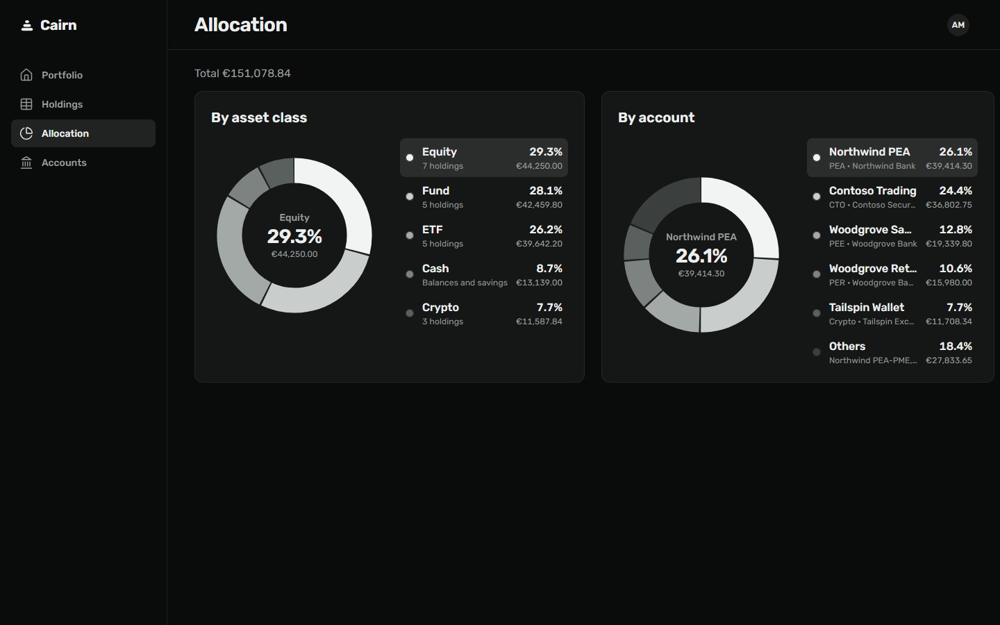
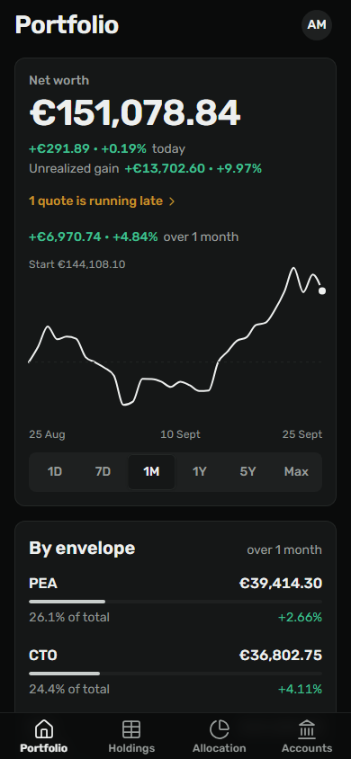
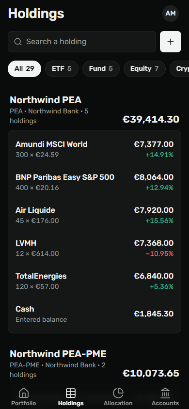
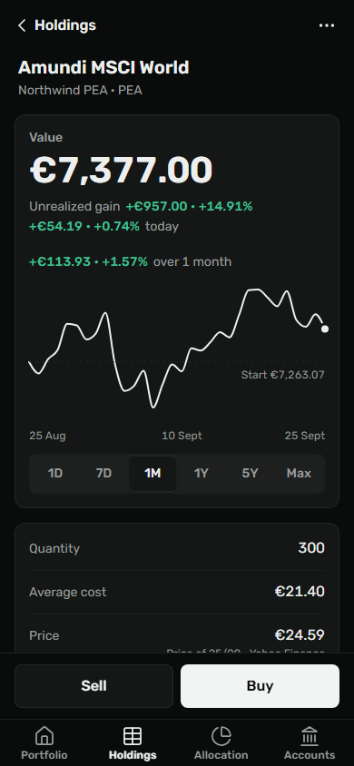

<p align="center">
  <picture>
    <source media="(prefers-color-scheme: dark)" srcset="docs/github/banner-dark.png">
    
  </picture>
</p>

<br>

<div align="center">

[](https://github.com/JoanRoucoux/cairn-web/actions/workflows/ci.yml)
[](https://github.com/JoanRoucoux/cairn-web/actions/workflows/deploy.yml)
[](https://github.com/JoanRoucoux/cairn-web/releases/latest)
[](LICENSE)

</div>

# cairn-web

The Angular frontend of [Cairn](https://github.com/JoanRoucoux/cairn), a single-owner wealth tracker. The product, the architecture and the backend are documented in the Cairn repository.

It is built on the [Cairn UI](https://github.com/JoanRoucoux/cairn-ui) design system ([Storybook](https://joanroucoux.github.io/cairn-ui/)) and runs at https://cairn.joanroucoux.fr, behind passkey sign-in.

<p align="center">
  
</p>

<table>
  <tr>
    <td width="50%"></td>
    <td width="50%"></td>
  </tr>
</table>

<p align="center">
  
  
  
</p>

The data shown is fictional.

## Highlights

- **Modern Angular**: Angular 22, standalone components, zoneless, signals (`rxResource`, Signal Forms), OnPush by default, and no state library.
- **Lazy by feature**: every feature is loaded on demand through `loadChildren` in [`src/app/app-routes.ts`](src/app/app-routes.ts).
- **Typed API client**: generated by Orval from the OpenAPI contract, kept in sync with the backend by `pnpm run api:sync` and checked against the backend's `main` in CI.
- **Passkey sign-in**: the WebAuthn ceremony lives in [`src/app/core/webauthn/`](src/app/core/webauthn), with a password fallback.
- **i18n**: English and French with Transloco, one lazy scope per feature, and the chosen language persisted.
- **Display preferences**: light, dark or system theme, and a toggle that hides every amount.
- **Installable**: a web app manifest. There is no service worker, on purpose (see [AGENTS.md](AGENTS.md)).
- **Enforced boundaries**: Sheriff checks the module boundaries at lint time.
- **Bundle budget**: the initial bundle is capped at 530 kB (warning) and 630 kB (error). It currently weighs 502.83 kB raw and 113.94 kB gzip, after moving cairn-ui to per-component subpaths.
- **Tested**: Vitest and Angular Testing Library with lines and branches at 100 %, plus a Playwright end-to-end suite that includes axe accessibility checks. Everything runs against a mocked API.
- **Shipped on every push to main**: an nginx image pushed to GHCR, then a CalVer release.

## Screens

| Route                  | Screen         | What it shows                                                             |
| ---------------------- | -------------- | ------------------------------------------------------------------------- |
| `/`                    | Portfolio      | Net worth, value curve, envelopes and movers.                             |
| `/allocation`          | Allocation     | The breakdown by asset class and by account.                              |
| `/holdings`            | Holdings       | Every holding, grouped by account, with search and an asset class filter. |
| `/holdings/:holdingId` | Holding detail | One holding beside the list: figures, facts, trades and quote actions.    |
| `/accounts`            | Accounts       | The accounts (envelopes), their totals, and create, edit and delete.      |
| `/profile`             | Profile        | Theme, language, hide amounts, CSV import and export, passkeys, sign out. |
| `/login`               | Sign in        | Passkey first, with a password fallback.                                  |
| any other URL          | Not found      | The 404 page.                                                             |

## Getting started

Prerequisites: Node `^22.22.3`, `^24.15.0` or `>=26` (`engines` in `package.json`; `.nvmrc` pins 24) and [pnpm](https://pnpm.io) (the version is pinned in the `packageManager` field).

```bash
pnpm install    # installs dependencies and generates the API client (postinstall)
pnpm start      # dev server on http://localhost:4200
```

The dev server proxies `/api` to `http://localhost:8080` ([`proxy.conf.json`](proxy.conf.json)), where the Cairn backend is expected. To run the backend, follow [`docs/development.md`](https://github.com/JoanRoucoux/cairn/blob/main/docs/development.md) in the Cairn repository.

## Scripts

| Script                   | Description                                                              |
| ------------------------ | ------------------------------------------------------------------------ |
| `pnpm start`             | Dev server (with API proxy)                                              |
| `pnpm run build`         | Production build into `dist/`                                            |
| `pnpm run build:dev`     | Development build                                                        |
| `pnpm run watch`         | Development build in watch mode                                          |
| `pnpm test`              | Unit tests (Vitest)                                                      |
| `pnpm run test:coverage` | Unit tests with coverage report and thresholds                           |
| `pnpm run e2e`           | End-to-end tests (Playwright)                                            |
| `pnpm run e2e:ui`        | End-to-end tests in the Playwright UI                                    |
| `pnpm run lint`          | Lint (ESLint, includes Sheriff module boundaries)                        |
| `pnpm run lint:fix`      | Lint and fix                                                             |
| `pnpm run format`        | Format the whole project (Prettier)                                      |
| `pnpm run format:check`  | Check the formatting                                                     |
| `pnpm run generate:api`  | Regenerate the API client from `openapi/openapi.yaml`                    |
| `pnpm run api:sync`      | Fetch the backend's current OpenAPI contract, then regenerate the client |

## Project structure

```text
src/app/
  core/       Global infrastructure: session, theme, i18n, interceptors, logger,
              WebAuthn, app shell (sidebar and tab bar), 404 page.
              core/api-client/ is generated by Orval and never edited by hand.
  shared/     Reusable presentation and test helpers (charts, dialogs, forms,
              formatting, layout). Imports neither core nor features.
  features/   One folder per business feature: portfolio, holdings, accounts,
              profile and login. Each one has a <feature>-routes.ts,
              which is its public API, and one folder per screen.
```

Sheriff enforces the dependency rules at lint time ([`sheriff.config.ts`](sheriff.config.ts)): features depend on `core` and `shared`, `core` depends on `shared`, `shared` depends on nothing, and features never import each other. Modules are barrel-less: import files directly.

## Documentation

[AGENTS.md](AGENTS.md) holds the architecture, conventions, testing guidelines, deployment and release flow.

## License

[MIT](LICENSE)

<sub>Scaffolded from [angular-starter-web](https://github.com/JoanRoucoux/angular-starter-web).</sub>
